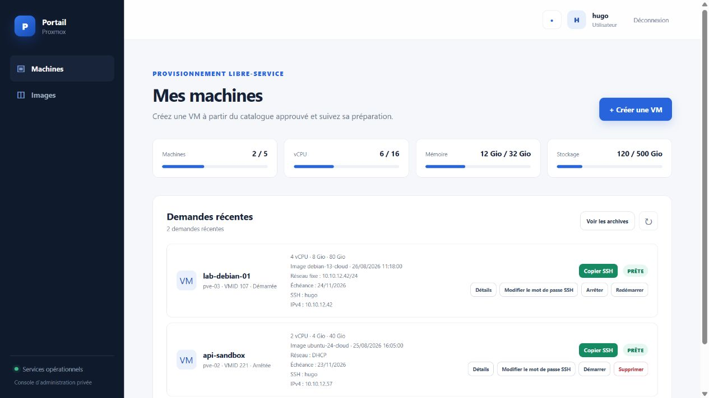
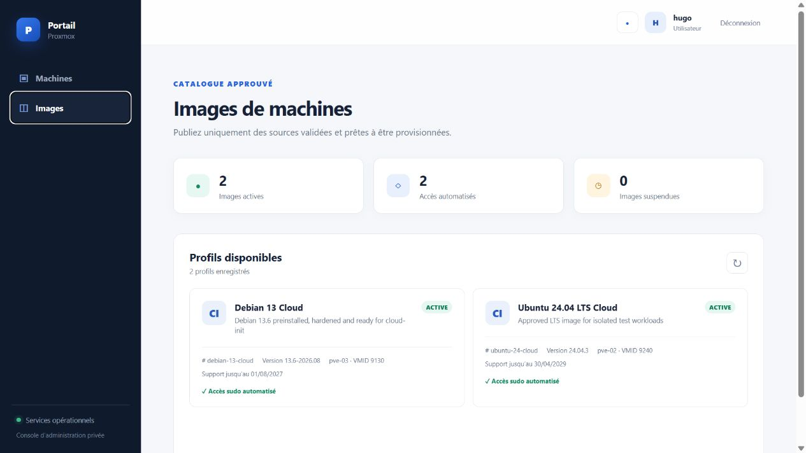

<p align="right"><a href="README.fr.md">🇫🇷 Français</a></p>

# Proxmox VM Portal

A self-service web portal for provisioning secure Proxmox virtual machines from
approved ISO and cloud-init templates.

Users can request a ready-to-use VM without accessing Proxmox directly. The
portal applies quotas, lifecycle rules, network isolation, SSH access, audit
logging, and optional approval workflows. Administrators manage the cluster,
images, VLANs, integrations, users, and maintenance from the web interface.

[](LICENSE)


## Screenshots

### Sign in


### Self-service machines



### Approved image catalogue



The screenshots use a local demonstration dataset. They contain no production
credentials, infrastructure identifiers, or patient data.

## What it provides

- Cloud-init cloning for immediately usable Debian and Ubuntu test VMs.
- A non-root sudo account chosen by the requester, with SSH credentials handled
  without storing the clear-text password.
- DHCP or static IPv4 assignment from administrator-approved VLAN profiles.
- NetBox validation and IP reservation.
- Sandbox networking by default: Proxmox firewall policy is deny-by-default and
  only approved internal services are reachable.
- A GLPI link and audited workflow for temporary sandbox release requests.
- Local, LDAP/LDAPS, or Keycloak/OIDC authentication.
- Per-user quotas, optional administrative approval, and VM expiration rules.
- Start, stop, reboot, delete, SSH password reset, APT maintenance, and fleet
  reporting from the portal.
- PostgreSQL-backed jobs, notifications, audit records, Prometheus metrics,
  SIEM export, and optional Zabbix integration.
- Signed release images, SBOM, provenance, encrypted backups, and a fully
  autonomous Debian 13 offline bundle.

## Quick installation on Debian 13

The autonomous bundle is the simplest and recommended installation method. It
contains the application and every required container image. The target VM does
not need a GitHub token and does not need Internet access after the two release
files have been transferred.

Minimum recommended VM size:

- Debian 13 amd64
- 2 vCPU
- 4 GiB RAM
- 30 GiB disk
- one reachable IPv4 address

### 1. Download and install

Run the following as a sudo-capable user on a fresh Debian 13 VM:

```bash
version=0.25.0
base="https://github.com/Zachiran42/proxmox-vm-portal/releases/download/v${version}"
bundle="proxmox-vm-portal-offline-${version}-amd64.tar.gz"

curl --proto '=https' --tlsv1.2 --fail --location --remote-name "${base}/${bundle}"
curl --proto '=https' --tlsv1.2 --fail --location --remote-name "${base}/${bundle}.sha256"
sha256sum --check "${bundle}.sha256"
tar -xzf "${bundle}"
sudo bash "proxmox-vm-portal-offline-${version}-amd64/install-offline.sh"
```

The installer automatically:

1. verifies the complete bundle;
2. installs Docker and the required Debian packages;
3. starts PostgreSQL, the API, the worker, and Caddy;
4. detects the VM IPv4 address;
5. creates a local self-signed TLS authority;
6. generates the application secrets and encrypted-backup identity; and
7. starts the portal at `https://SERVER_IP`.

No Proxmox, LDAP, NetBox, DNS, or public certificate information is requested
during this first installation.

### 2. Open the portal

The initial administrator credentials are written to a root-only file:

```bash
sudo cat /root/proxmox-vm-portal-initial-credentials.txt
```

Open the displayed HTTPS URL. The browser will warn about the local certificate
until you trust the generated CA or replace it with your internal PKI
certificate. The portal requires the temporary administrator password to be
changed on first sign-in.

Check the installation at any time:

```bash
cd /opt/proxmox-vm-portal
sudo bash deploy/scripts/compose.sh ps
curl --insecure --fail --silent https://SERVER_IP/healthz
```

### 3. Connect Proxmox

In the portal, open **Administration → Infrastructure integrations** and enter:

- the Proxmox API URL, for example
  `https://pve.example.internal:8006/api2/json`;
- a dedicated non-root token ID such as
  `portal@pve!provisioning`;
- the token secret; and
- the Proxmox CA certificate when it is not already trusted.

The portal tests TLS, the token, and visible cluster nodes before saving the
encrypted secret. Never use `root@pam`.

The recovery CLI remains available:

```bash
sudo /opt/proxmox-vm-portal/deploy/scripts/configure-proxmox.sh
sudo /opt/proxmox-vm-portal/deploy/scripts/check-proxmox.sh
```

See [Deployment](docs/DEPLOYMENT.md) for firewall rules, DNS, certificates,
Proxmox ACLs, and production hardening. See [Air-gapped installation](docs/AIRGAP.md)
for controlled transfer and CMDB checksum procedures.

## Updates

For an installation created from an autonomous bundle, download the newer
bundle and run:

```bash
cd proxmox-vm-portal-offline-NEW_VERSION-amd64
sudo bash install-offline.sh --update
```

The updater creates an encrypted backup before replacing the application,
preserves configuration and secrets, runs database migrations, waits for
health checks, and retains rollback material until the update succeeds.

Read [Backup and restore](docs/BACKUP_RESTORE.md) before the first production
deployment.

## Security model

The service is designed for on-premises environments, including isolated
healthcare infrastructure:

- secrets are mounted as root-managed files and never committed to Git;
- application containers run read-only as UID 10001 with all capabilities
  dropped;
- Proxmox access uses a least-privilege API token and HTTPS only;
- new VMs start in an enforced sandbox policy;
- passwords and Proxmox error details are excluded from audit records;
- sessions use secure, HttpOnly, SameSite cookies and CSRF protection;
- provisioning is asynchronous and safely reconciles ambiguous Proxmox tasks;
- release images are immutable, signed through GitHub OIDC, and published with
  SBOM and provenance evidence.

Security controls do not replace local risk assessment, network ACLs, trusted
PKI, off-site backups, or the CHU change-management process. Start with the
[threat model](docs/THREAT_MODEL.md) and [security review](docs/SECURITY_REVIEW.md).

## Main documentation

| Topic | Guide |
|---|---|
| Production deployment | [docs/DEPLOYMENT.md](docs/DEPLOYMENT.md) |
| Autonomous/offline installation | [docs/AIRGAP.md](docs/AIRGAP.md) |
| Proxmox architecture and ACLs | [docs/ARCHITECTURE.md](docs/ARCHITECTURE.md) |
| Debian cloud-init image factory | [docs/IMAGE_FACTORY.md](docs/IMAGE_FACTORY.md) |
| Guest SSH access | [docs/GUEST_ACCESS.md](docs/GUEST_ACCESS.md) |
| VLANs, NetBox, and connectivity | [docs/NETWORKS_NETBOX.md](docs/NETWORKS_NETBOX.md) |
| Sandbox firewall policy | [docs/SANDBOX.md](docs/SANDBOX.md) |
| LDAP/LDAPS | [docs/LDAP.md](docs/LDAP.md) |
| Keycloak/OIDC | [docs/KEYCLOAK.md](docs/KEYCLOAK.md) |
| VM maintenance and lifecycle | [docs/VM_MAINTENANCE.md](docs/VM_MAINTENANCE.md), [docs/MCO.md](docs/MCO.md) |
| Monitoring and SIEM | [docs/OBSERVABILITY.md](docs/OBSERVABILITY.md), [docs/ZABBIX.md](docs/ZABBIX.md), [docs/SIEM.md](docs/SIEM.md) |
| Release verification | [docs/RELEASES.md](docs/RELEASES.md) |

## Local development

```bash
python3 -m venv .venv
. .venv/bin/activate
pip install -e '.[dev]'
cp .env.example .env
# Fill only the local, ignored .env file.
set -a
. ./.env
set +a
flask --app 'portal:create_app' db upgrade
flask --app 'portal:create_app' bootstrap-admin
flask --app 'portal:create_app' run
```

Run the worker in a second terminal:

```bash
flask --app 'portal:create_app' worker
```

## Tests

Tests use fake Proxmox and integration clients; they do not contact a real
cluster or require real secrets.

```bash
pytest -q
```

## License

[GPL-3.0](LICENSE)
